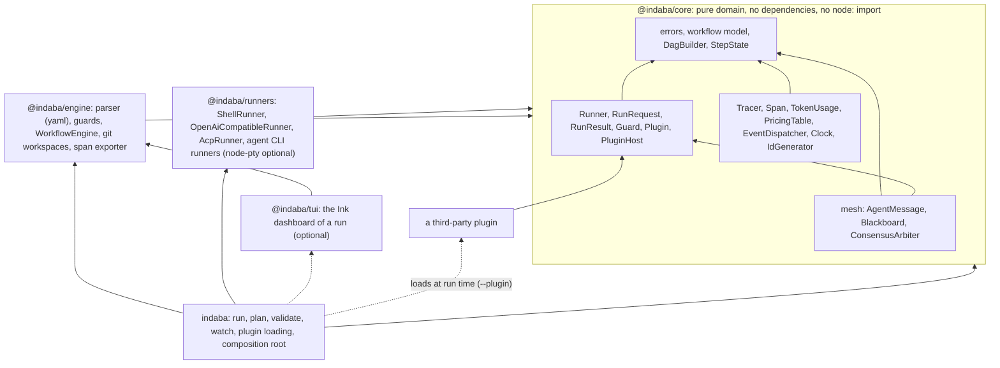

# Dependency map

How the packages depend on each other, and what breaks what. Updated at stage 8 of every feature.

## Import direction

Arrows point toward the package depended on, so `@indaba/core` sits at the bottom and imports
nothing. `engine` and `runners` never import each other; only `indaba` (the CLI) knows both, and it
registers the built-in runners and the git-diff guard through the same `PluginHost` a third-party
plugin receives. The mesh depends on the `Runner` *contract*, which lives in core, never on a
runner. A plugin depends only on the contracts in `@indaba/core`.

The guards are the layers tests: `packages/core/test/architecture.test.ts` (core imports only itself,
no `node:` module), `packages/engine/test/layers.test.ts` and `packages/runners/test/layers.test.ts`
(only relative files, `node:*`, the declared dependency and `@indaba/core`; never the runners, the
engine or the CLI upward). A new edge is a design question first and a test change second.

## Feature to package

| Feature (spec) | Packages |
| :--- | :--- |
| `typescript-port` | all |
| `workflow-engine` | `@indaba/core` (model, DAG, state), `@indaba/engine` (parser, guards, engine) |
| `agent-mesh` | `@indaba/core` |
| `runner-adapters` | `@indaba/core` (contract), `@indaba/runners` |
| `transport-priority` | `@indaba/core` (runner chain, permissions model, glob, span events), `@indaba/engine` (parser, fallback loop, scope guard), `@indaba/runners` (API and ACP runners), `indaba` |
| `git-workspace` | `@indaba/engine` |
| `observability` | `@indaba/core` (tracer, value types), `@indaba/engine` (exporter) |
| `cli` | `indaba` |
| `tui` | `@indaba/engine` (event stream, run view model, sanitizer), `@indaba/tui` (the dashboard), `indaba` (`watch`) |
| `mcp-support` | `@indaba/core` (capability contracts), `@indaba/engine`, `@indaba/runners` |
| `desktop-app`, `web-app` | not started; to be re-specified against these packages |

## What breaks what

- Changing `Runner`, `RunRequest` or `RunResult` in core breaks every runner, the mesh participant
  and every plugin's runner: a major.
- Changing `Guard`, `Plugin` or `PluginHost` breaks every plugin: a major.
- Changing a workflow model type or the schema breaks the parser, the engine and every workflow file
  in the wild: a major.
- Renaming a span attribute or an event breaks consumers' dashboards and listeners: a major.
- Adding a member to a string-literal union (a step status, a failure action) breaks consumers who
  switch over it exhaustively.
- A new runtime dependency changes every consumer's dependency tree; it is a recorded decision
  (`project.runtime_dependencies` and `project.optional_dependencies` in `workflow.ai.yml`). Today:
  `yaml` in the engine, `ink` and `react` in `@indaba/tui` (which only the optional dashboard loads), and optionally `node-pty` in the runners.

## Runtime state, not code

`.indaba/worktrees/`, `.indaba/traces/` and `.indaba/artifacts/` are produced by Indaba when it runs,
and are gitignored. They are unrelated to the development workflow file at the repository root.
