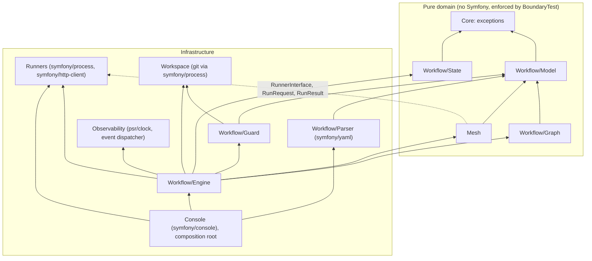

# Dependency map

How the modules depend on each other, and what breaks what. Updated at stage 8 of every feature.

## Import direction

The dotted edge is the one place the domain looks outward: the mesh depends on the runner
*contract*, not on any runner. `tests/Unit/Architecture/BoundaryTest.php` encodes the allowed edges.
The edges above are drawn from the imports present in the initial commit; correct them when the code
changes, and treat a new edge as a design question first.

## Feature to module

| Feature (spec) | Modules |
| :--- | :--- |
| `workflow-engine` | `Core`, `Workflow/*` |
| `agent-mesh` | `Mesh` |
| `runner-adapters` | `Runners` |
| `git-workspace` | `Workspace` |
| `observability` | `Observability` |
| `cli` | `Console`, `bin/indaba` |

## What breaks what

- Changing `RunnerInterface`, `RunRequest` or `RunResult` breaks every runner, the mesh participant
  and every embedder's custom runner: a major.
- Changing a `Workflow/Model` type or the schema breaks the parser, the engine and every workflow file
  in the wild: a major.
- Renaming a span attribute or an event breaks consumers' dashboards and listeners: a major.
- Adding a state or an enum case breaks consumers who `match` on it exhaustively.
- A new runtime dependency changes every consumer's dependency tree; it is a recorded decision
  (`project.runtime_dependencies` in `workflow.ai.yml`).

## Runtime state, not code

`.indaba/worktrees/`, `.indaba/traces/` and `.indaba/artifacts/` are produced by Indaba when it runs,
and are gitignored. They are unrelated to the development workflow file at the repository root.
